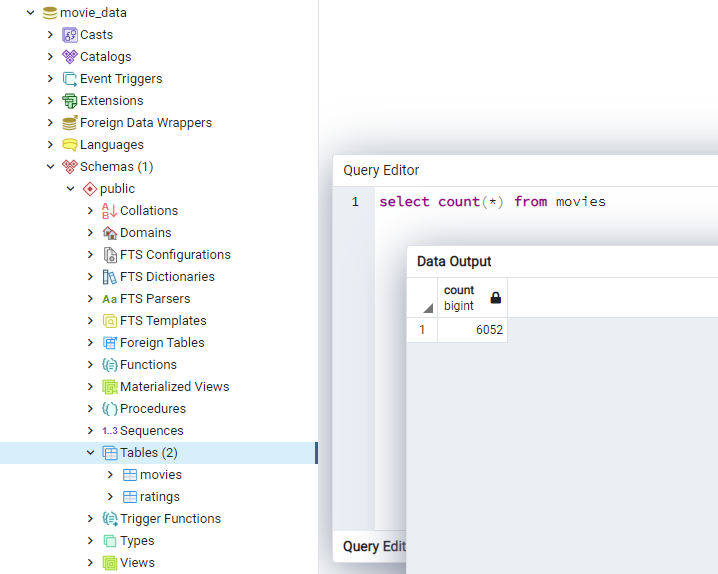
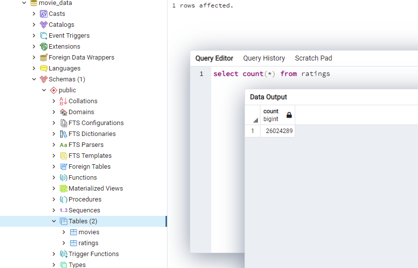

# ETL: Movie Data on Wikipedia, Kaggle 
This repo contains several iPython notebooks that were created as pieces of an ETL pipeline that pulls movie data from .csv files, transforms them to remove unnecessary or redundant columns as well as make the data more usable, and then upload the data to a postgreSQL server hosted on the local machine.

I have not included the source data in this repo, as it is quite large - please send me a direct message if you'd like a copy of the raw datasets. If you'd like to run these notebooks on your local machine, you'll need to add the following:
* **wikipedia-movies.json** in the working directory (with the notebooks)
* **movies_metadata.csv** within a folder called "kaggle" located in the working directory
* **ratings.csv**  within a folder called "kaggle" located in the working directory
* **config.py** in the working directory with a value for "db_password" (your postgreSQL server password)

The order I created these notebooks in is as follows:
1. **Movies_Testing.ipynb** initial EDA, granular testing of all ETL steps
2. **ETL_function_test.ipynb** skeleton of automated ETL pipeline via master function, set up initial dataframes
3. **ETL_clean_wiki_movies.ipynb** adding wikipedia data transformations to master function
4. **ETL_clean_kaggle_data.ipynb** adding kaggle data transformations to master function
5. **ETL_create_database.ipynb** using the master function created in previous iterations, transform all data and upload to local postgreSQL server

If you're here to get insight on the initial EDA process for an ETL, I'd suggest looking at [Movies_Testing.ipynb](./Movies_Testing.ipynb) as its broken into smaller code chunks for iterative testing.
If you're here to admire a fully-functional ETL pipeline, I'd suggest skipping to [ETL_create_database.ipynb](./ETL_create_database.ipynb) as it is the most complete and concise version of the code contained in the other notebooks.

Screenshots of SQL queries confirming the movies and ratings tables were created successfully:

Frank Feder, 2021